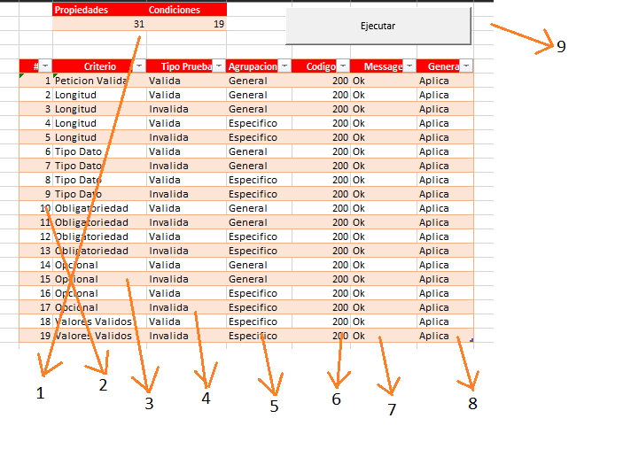

# Automatizacion-pruebas-servicios-REST
Estas herramientas muy sencilla pueden ayudarnos a la automatización de pruebas de Web Servicies REST Utilizando la herramienta JMETER 3 o 5

[TOC]

### Preparación de data


1. Indice que corresponde al contador de la propiedades `Ejemplo: 1,3,10`
2. Nombre del parametro `Ejemplo: Name,Apellido,Version`
3. Valor de la propiedad que es asignado cuando la peticion es valida `Ejemplo: BBS,es_CO`
4. Valores que puede tomar una propiedad,solo aplica para tipos de dato array cada valor es separado por coma  `Ejemplo: CC,CE,NI,TI`
5. Valor que corresponde al tamaño maximo de la propiedad un numero entero,si no tiene tamaño maximo dejar campo vacio `Ejemplo: 25,45,39` 
6. Valor que corresponden la propiedad de obligatoriedad de un campo si aplica se escribe `X` si no se deja el campo vacio
7.  Valores que corresponde al tipo de dato de la propiedad puede ser: `String,Integet,Number,Boolean,Date-time,Array` 
8.  Valores que corresponde al dato invalido simpre y cuando sea un tipo de dato array y tenga diferentes valores posibles
9.  Valores que corresponden al tipo de propiedad que puede ser: `Header,Body,Query,Path`



1. Contador de numero de propiedades y numero de criterios a evaluar,toma en cuenta los indeces para realizar esta operacion
2. s

### Instalacion de herramientas

#### Jmeter

1.  Descargar la herramienta JMeter version 3.1 o 5, [Dowload](https://archive.apache.org/dist/jmeter/binaries/)
2.  Descargar la herramienta tika-app.jar, [Dowload](https://www-us.apache.org/dist/tika/)
3.  Una vez descargado las herramienta en la carpeta origen del jmeter mover el archivo `tika-app.jar` en la ruta `Jmeter/lib/`
4.  Ejecutar el archivo `Jmeter/bin/ApacheJMeter.jar`


### Documentacion Api JmeterExcel.jar

#### Class Work

###### Constructor

###### Metodos

#### Class SheetWork

###### Metodos

```
ArrayList<Parametro> getListPropiedades()
```
> Metodo que retorna una lista de parametros correspondiente a los parametros en la sheet parametros, solo aplica con esta sheet 

```
ArrayList<Parametro> getListParametrosHeader(int row)
```
> Metodo que retorna una lista de parametros correspondiente a las parametros solo a la sheet parametros solo aplioca con esta sheet

```
ArrayList<Parametro> getListParametrosBody(int row)
```
> Metodo que retorna una lista de parametros correspondiente a las parametros solo a la sheet parametros solo aplioca con esta sheet

```
ArrayList<Parametro> getListParametrosPath(int row)
```
> Metodo que retorna una lista de propiedade correspondiente a las parametros solo a la sheet parametros solo aplioca con esta sheet

```
ArrayList<Parametro> getListParametrosQuery(int row)
```
> Metodo que retorna una lista de parametros correspondiente a las parametros solo a la sheet parametros solo aplioca con esta sheet

```
public ArrayList<Parametro> getListParametrosCode(int row)
```
> Metodo que retorna una lista de parametros correspondiente a las parametros solo a la sheet parametros solo aplioca con esta sheet

```
ArrayList<Parametro> getListParametrosMessage(int row)
```
> Metodo que retorna una lista de parametros correspondiente a las parametros solo a la sheet parametros solo aplioca con esta sheet

#### Class Parametro

###### Constructor

```
new Parametro(String name, String value) 
```
> Constructor de clase recibe nombre propiedad y correspondiente valor


###### Metodos

```
String getValue()
```
> Metodo que retorna una cadena de caracteres con eñ valor de la propiedad

```
long getValueNumber()
```
> Metodo que retorna un valor entero correspondiente a la propiedad solo aplica para propiedades tipo integer o number

```
String getTipoDato()
```

> Metodo que retorna una cadena de caracteres con el tipo de dato correspondiente a la propiedad que puede ser: String,Date-time,Integer,Number,Boolean o Array

```
String getTipoParametro()
```
> Metodo que retorna una cadena de caracteres con el tipo de parametro correspondiente a la propiedad que puede ser: Header,Body,Path o Query

```
String getName()
```
> Metodo que retorna una cadena de caracteres con el nombre de la propiedad
